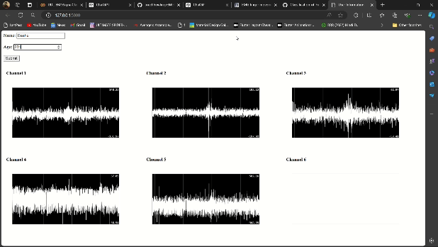

# EMG Recording Software

## Overview
This software is designed to receive EMG data through an ESP via WebSocket. After applying filters, the data is sent to the frontend using Flask WebSocket.

## Components
- **app.py:** Flask application for serving the frontend and managing WebSocket communication.
- **cleanespread.py:** Receives data from the ESP and emits data as buffers through SocketIO.
- **digitalfilter.py:** Contains prebuilt classes and functions for applying various filters to the data.
- **static folder:** Contains JavaScript files for the frontend.

## Screens
1. **Home Screen:**
    - User enters name and age.
    - Verifies all channels are connected.
    - 
2. **Action Guide Screen:**
    - Guides the user on how to perform actions, specifying which finger to move and when to move it.
    - 

## Installation and Setup
1. Install the required modules:
    ```sh
    pip install -r requirements.txt
    ```
2. Run the Flask application:
    ```sh
    python app.py
    ```
3. Ensure you are connected to the ESP Wi-Fi named `multiemg` to receive data. Without this connection, labelling will not be possible.

## Active Issue
- You need to run the app every time for a new recording. This could potentially be solved by threading.

## Credits
- **Firmware:** Credits to Mahesh for creating the firmware for the ESP to receive multi-channel data.
- **Support and Guidance:** Special thanks to [Upside Down Labs](https://upsidedownlabs.tech) for their continuous support and guidance.

